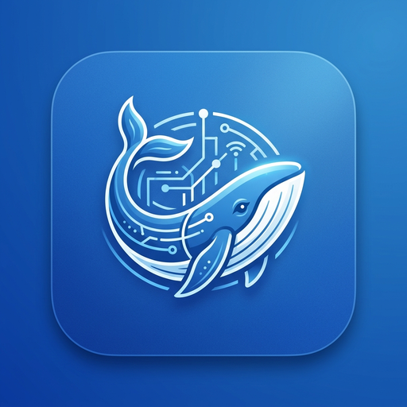
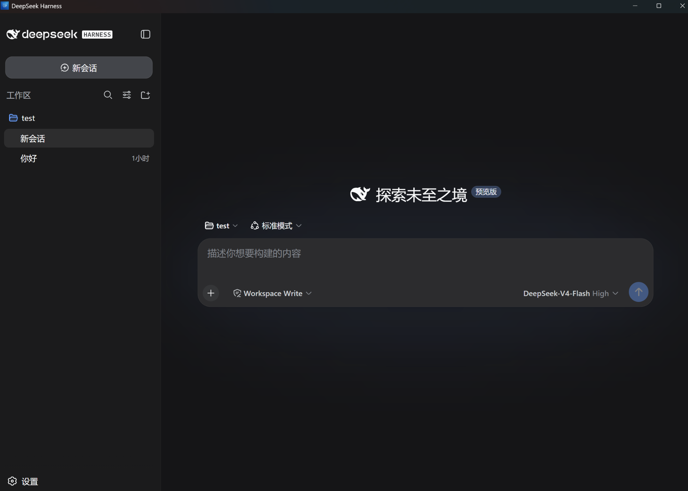

# DSH-UI: DeepSeek Harness 官方风格极轻桌面客户端

<p align="center">
  
</p>

<p align="center">
  <strong>基于 <a href="https://github.com/tw93/Pake">tw93/Pake</a> 与 <a href="https://github.com/deepseek-ai/deepseek-harness">deepseek-ai/deepseek-harness</a> 深度定制打造</strong>
</p>

<p align="center">
  <a href="https://github.com/xtxo/dsh-ui/releases"></a>
  
  
  <a href="LICENSE"></a>
</p>

<p align="center">
  <a href="https://xtxo.github.io/dsh-ui/">🌐 在线主页</a> •
  <a href="#-快速下载">下载客户端</a> •
  <a href="#-核心优势">核心优势</a> •
  <a href="#-本地编译与打包指南">自主构建</a> •
  <a href="README_EN.md">English</a>
</p>

---

<p align="center">
  
</p>

---

## 🌟 核心优势

* **🍃 极致轻巧（仅 ~8.7MB）**：告别动辄 150MB+ 的臃肿 Electron 壳。基于 Rust + 系统原生 Webview2 / WebKit 渲染容器，内存占用降低 80% 以上。
* **⚡ 毫秒级极速唤醒**：内置智能缓存直启引擎，跳过 npx 的每次远端联网解析，双击即秒开。
* **🚀 全自动服务生命周期（双击即用）**：
  * 无需手动在终端输入命令。
  * 双击客户端，Rust 内核自动在后台以无黑框静默模式拉起 `dsh web` 智能体服务。
  * 自动进行端口探针与握手，就绪后瞬间切入对话窗口。
  * 退出应用时自动彻底释放后台进程，无幽灵进程残留。
* **🎨 DeepSeek 原生品牌与动效**：
  * 内置 16x16 ~ 512x512 高清多尺寸蓝鲸图标。
  * 专属暗色呼吸感启动过渡页面。
* **📁 桌面级原生交互增强**：
  * 开启本地文件 / 代码项目拖拽支持（Drag & Drop）。
  * 支持 Windows / macOS 系统托盘常驻与快捷键呼出。

---

## 📥 快速下载

前往 [GitHub Releases 页面 (v0.1.8)](https://github.com/xtxo/dsh-ui/releases/tag/v0.1.8) 或直接点击下方直链下载：

| 平台 | 安装包直接下载 | 架构说明 |
| :--- | :--- | :--- |
| **macOS (Apple Silicon)** | 🍏 [**DeepSeek.Harness_0.1.8_aarch64.dmg**](https://github.com/xtxo/dsh-ui/releases/download/v0.1.8/DeepSeek.Harness_0.1.8_aarch64.dmg) | M1 / M2 / M3 / M4 系列 Mac |
| **Windows** | 🪟 [**DeepSeek.Harness_0.1.8_x64-setup.exe**](https://github.com/xtxo/dsh-ui/releases/download/v0.1.8/DeepSeek.Harness_0.1.8_x64-setup.exe) | Windows 10 / 11 64位 安装包 |
| **Windows MSI (中文)** | 🪟 [**DeepSeek.Harness_0.1.8_x64_zh-CN.msi**](https://github.com/xtxo/dsh-ui/releases/download/v0.1.8/DeepSeek.Harness_0.1.8_x64_zh-CN.msi) | MSI 中文安装包 |
| **Windows MSI (英文)** | 🪟 [**DeepSeek.Harness_0.1.8_x64_en-US.msi**](https://github.com/xtxo/dsh-ui/releases/download/v0.1.8/DeepSeek.Harness_0.1.8_x64_en-US.msi) | MSI 英文安装包 |

---

## 🛠️ 本地编译与打包指南

本项目完全开源，任何人都可以根据本指南在本地自行编译打包属于自己的客户端！

### 1. 准备环境
- 安装 [Node.js](https://nodejs.org/) (>= 18)
- 安装 [Rust 编译器与 Cargo](https://www.rust-lang.org/) (1.80+)

### 2. 克隆仓库与安装依赖
```bash
git clone https://github.com/xtxo/dsh-ui.git
cd dsh-ui
npm install
```

### 3. 一键编译

#### 🍏 macOS 编译 (DMG / APP)
```bash
# 方式一：直接运行构建脚本
chmod +x ./scripts/build-macos.sh
./scripts/build-macos.sh

# 方式二：编译 Apple Silicon 或 Intel
npm run build:mac-arm64  # M1/M2/M3/M4
npm run build:mac-x64    # Intel
```
编译产物位于：`src-tauri/target/release/bundle/dmg/`

#### 🪟 Windows 编译
```powershell
# 方式一：直接运行脚本
.\scripts\build-windows.ps1

# 方式二：使用 npm 脚本
npm run build:windows
```
编译产物位于：`src-tauri/target/release/deepseek-harness.exe`

#### 🐧 Linux 编译 (DEB / AppImage)
```bash
chmod +x ./scripts/build-linux.sh
./scripts/build-linux.sh
```

---

## 📂 项目结构

```
dsh-ui/
├── src-tauri/              # 🦀 Rust / Tauri Pake 核心源码与后台生命周期管理器
│   ├── src/
│   │   ├── app/backend.rs  # 智能后台服务探针与拉起引擎
│   │   └── lib.rs          # 客户端入口
│   ├── icons/              # 多平台高清图标 (ICNS, ICO, PNG)
│   ├── pake.json           # Pake 桌面容器配置
│   ├── tauri.conf.json     # Tauri 基础配置
│   ├── tauri.macos.conf.json # macOS 专属构建配置
│   └── tauri.windows.conf.json # Windows 专属构建配置
├── dist/                   # 🎨 内置启动过渡页 (含 DeepSeek 动效)
├── website/                # 🌐 静态展示与下载主页 (https://xtxo.github.io/dsh-ui/)
├── scripts/                # 🛠️ 跨平台构建脚本 (Windows, macOS, Linux)
└── .github/workflows/      # 🚀 GitHub Actions 多平台自动化发布流水线
```

---

## ❓ 常见问题 (FAQ)

### Q1: 这是 DeepSeek 官方出品的桌面客户端吗？
> **答：** **本项目是对 DeepSeek Harness 官方生态的轻量桌面打包与原生交互封装。**
> - **官方纯正内核**：客户端后台拉起和运行的智能体服务、插件系统与模型调度代码 **100% 来源于 DeepSeek 官方仓库源码与官方 npm 引擎 (`@deepseek-ai/dsh`)**。
> - **完全开源透明**：本项目代码全部开源在 GitHub，不包含任何中间商服务，不收集用户任何私有数据或 API Key，所有配置与对话均仅保存在您本地电脑中。

### Q2: macOS 提示「Apple 无法验证是否包含恶意软件 / 已损坏」如何解决？
> **答：** 这是因为开源项目未购买苹果官方开发者商业签名证书（每年 $99），macOS Gatekeeper（安全门禁）会默认拦截。解决方法非常简单（任选一种即可）：
> 1. **方法一（推荐，3秒搞定）**：打开「访达」➔ 进入「应用程序」文件夹 ➔ **按住 Control 键并右键点击 `DeepSeek Harness.app`** ➔ 在弹出菜单中点击 **「打开」** ➔ 弹窗中选择 **「仍要打开」** 即可（仅需首次操作一次）。
> 2. **方法二（系统设置）**：打开 Mac **「系统设置」** ➔ **「隐私与安全性」** ➔ 找到「安全性」栏目 ➔ 点击 **「仍要打开」**。
> 3. **方法三（终端一条命令彻底放行）**：打开 Mac「终端」执行命令：
>    ```bash
>    xattr -cr "/Applications/DeepSeek Harness.app"
>    ```

### Q3: Windows 提示「Windows 已保护你的电脑 / SmartScreen」如何运行？
> **答：** 同样是由于个人开源软件未附带昂贵的商业证书，属于微软 SmartScreen 针对新发布软件的通用防护提示。
> 点击弹窗上的 **「更多信息 (More info)」** ➔ 选择 **「仍要运行 (Run anyway)」** 即可正常启动。

---

## 🤝 致谢与开源生态

- **[tw93/Pake](https://github.com/tw93/Pake)**：优秀的极简 Rust Web 桌面化引擎框架。
- **[deepseek-ai/deepseek-harness](https://github.com/deepseek-ai/deepseek-harness)**：DeepSeek 开源的“一切皆插件” Agent 框架。

---

## 📄 开源许可证

本项目基于 [MIT License](LICENSE) 协议开源。

